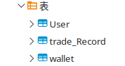
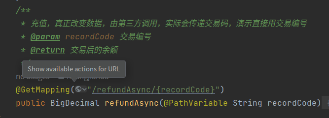

# 考试测试项目
## 介绍
### 数据库
- 数据库用了mybatis:8.0,
- 主要有三个表
1. user(用户),
2. trade_record（交易记录）,
3. wallet（钱包）
- 如图:
#### 

### 配套docker启动数据库
```sudo docker run --name mysql -e MYSQL_ROOT_PASSWORD=test_pwd -d --restart always mysql:8.0```
### 充值采用异步回收
####

### 省略部分
- 异常处理建种类
- 全局异常处理

